# Copy composer benchmark results

**Test VM specs**
- CPU 4 core Intel Xeon Processor (Cascadelake) speed~2095 MHz (max) 
- Ubuntu 20.04
- Kernel~4.15.0-1057-aws x86_64 
- Mem~8GB
- HDD~500GB
- PostgreSQL 12.7

Backup storage: Yandex Object Storage

Initial database size 100GB

# Experiment without intermediate updates

## Test DB and backup creation log
```
#!/bin/bash

get_time () {
    echo "$(date +%s)"
}

PGUSER=postgres
SCALE=6690 
for t in 100000000 500000000 1000000000 5000000000
do
cat > /var/lib/postgresql/.walg.json << EOF
{
    "WALG_S3_PREFIX": "s3://yourprefix/",
    "AWS_ACCESS_KEY_ID": "yourkey",
    "AWS_SECRET_ACCESS_KEY": "yourkey",
    "AWS_ENDPOINT": "https://storage.yandexcloud.net",
    "WALG_COMPRESSION_METHOD": "lz4",
    "WALG_DELTA_MAX_STEPS": "5",
    "WALG_TAR_SIZE_THRESHOLD": "$t",
    "PGDATA": "/var/lib/postgresql/12/main",
    "PGHOST": "/var/run/postgresql/.s.PGSQL.5432",
    "AWS_REGION": "yourregion",
    "PGUSER": "postgres",
    "PGPASSWORD": "postgres"
}
EOF
    chown postgres: /var/lib/postgresql/.walg.json

    start_time=$(get_time)
    log_name=log-start-${start_time}-scale-$SCALE-tar-$t-all
    echo "Generate tables start  $(get_time)" >> $log_name.txt 2>&1
    pgbench -U $PGUSER -i -s $SCALE -n
    echo "Generate tables finish $(get_time)" >> $log_name.txt 2>&1
    sleep 600
    echo "Plain push start       $(get_time)" >> $log_name.txt 2>&1
    ./main/pg/wal-g --config=/var/lib/postgresql/.walg.json backup-push /var/lib/postgresql/12/main --full
    echo "Plain push finish      $(get_time)" >> $log_name.txt 2>&1
    sleep 600
    echo "Copy push start        $(get_time)" >> $log_name.txt 2>&1
    ./main/pg/wal-g --config=/var/lib/postgresql/.walg.json backup-push /var/lib/postgresql/12/main --full --copy-composer
    echo "Copy push finish       $(get_time)" >> $log_name.txt 2>&1
    sleep 600
done
```

**CPU usage**

Tar size 100MB
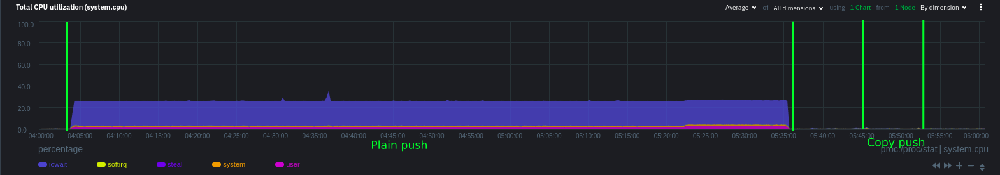
Tar size 500MB
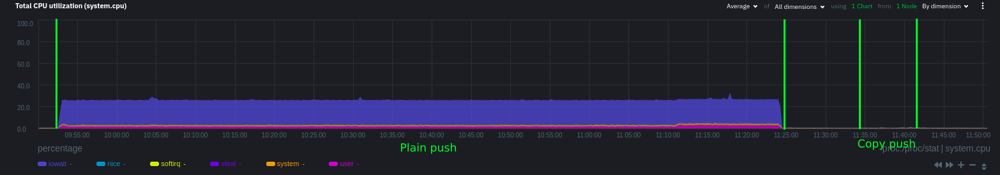
Tar size 1GB
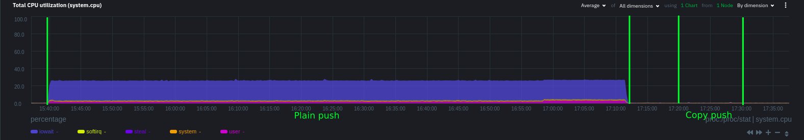
Tar size 5GB
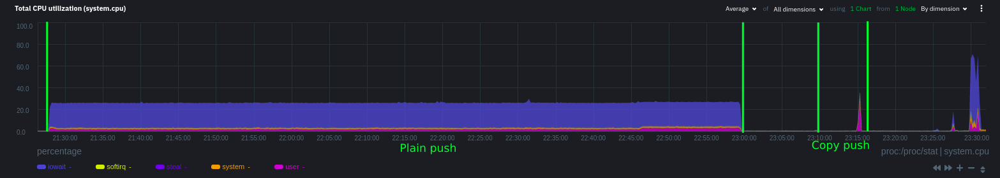

**Network usage**

Tar size 100MB
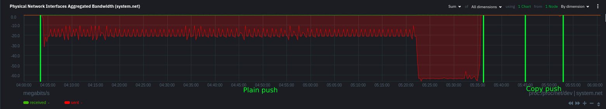
Tar size 500MB
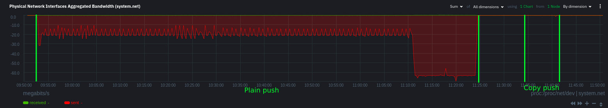
Tar size 1GB

Tar size 5GB
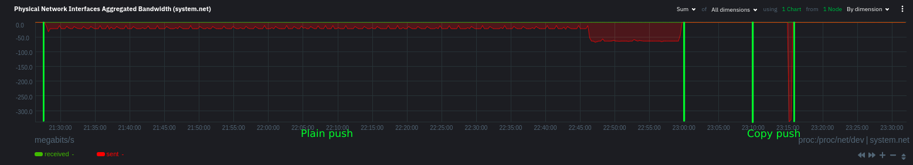

# Experiment intermediate updates
## Test DB and backup creation log
```
#!/bin/bash

get_time () {
    echo "$(date +%s)"
}

PGUSER=postgres
SCALE=6690

for size in 100000000 500000000 1000000000 5000000000
do
cat > /var/lib/postgresql/.walg.json << EOF
{
    "WALG_S3_PREFIX": "s3://walg/",
    "AWS_ACCESS_KEY_ID": "yourkey",
    "AWS_SECRET_ACCESS_KEY": "yourkey,
    "AWS_ENDPOINT": "https://storage.yandexcloud.net",
    "WALG_COMPRESSION_METHOD": "lz4",
    "WALG_DELTA_MAX_STEPS": "5",
    "WALG_TAR_SIZE_THRESHOLD": "$size",
    "PGDATA": "/var/lib/postgresql/12/main",
    "PGHOST": "/var/run/postgresql/.s.PGSQL.5432",
    "AWS_REGION": "yourregion",
    "PGUSER": "postgres",
    "PGPASSWORD": "postgres"
}
EOF
    chown postgres: /var/lib/postgresql/.walg.json
    start_time=$(get_time)
    log_name=log-start-${start_time}-scale-$SCALE-tar-$size-all
    ./main/pg/wal-g --config=/var/lib/postgresql/.walg.json delete everything FORCE --confirm
    echo "Restart postgres       $(get_time)" >> $log_name.txt 2>&1
    service postgresql restart
    echo "Generate tables start  $(get_time)" >> $log_name.txt 2>&1
    pgbench -U $PGUSER -i -s $SCALE -n
    echo "Generate tables finish $(get_time)" >> $log_name.txt 2>&1
    sleep 600
    echo "Plain push start       $(get_time)" >> $log_name.txt 2>&1
    ./main/pg/wal-g --config=/var/lib/postgresql/.walg.json backup-push /var/lib/postgresql/12/main --full
    echo "Plain push finish      $(get_time)" >> $log_name.txt 2>&1
    sleep 600
    for transactions in 10 20 50 100
    do
        pgbench -U $PGUSER -t $transactions
        echo "Running $transactions transactions" >> $log_name.txt 2>&1
        echo "Copy push start        $(get_time)" >> $log_name.txt 2>&1
        ./main/pg/wal-g --config=/var/lib/postgresql/.walg.json backup-push /var/lib/postgresql/12/main --full --copy-composer
        echo "Copy push finish       $(get_time)" >> $log_name.txt 2>&1
        sleep 600
    done
done
chmod 777 $log_name.txt
```

**CPU usage**

Tar size 100MB
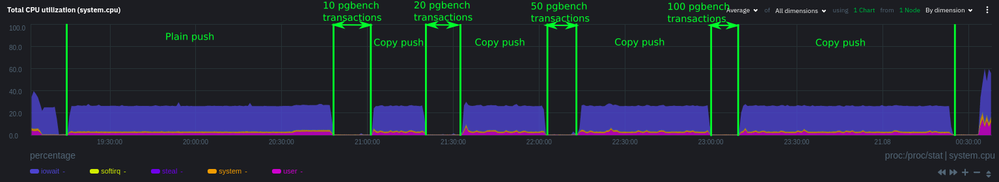
Tar size 500MB

Tar size 1GB
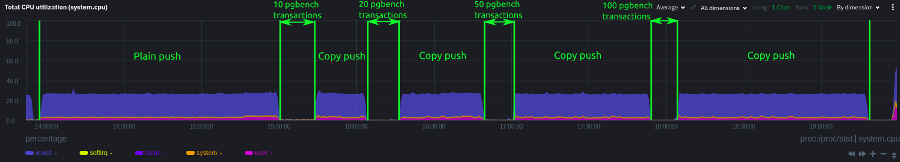
Tar size 5GB
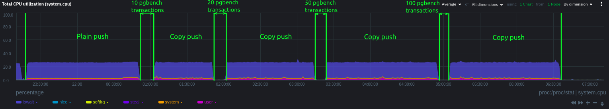

**Network usage**

Tar size 100MB
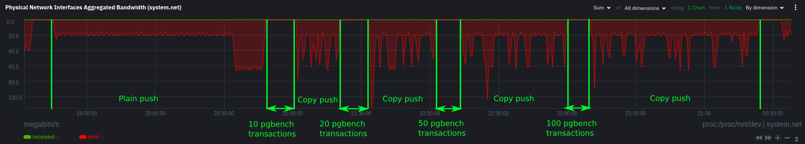
Tar size 500MB
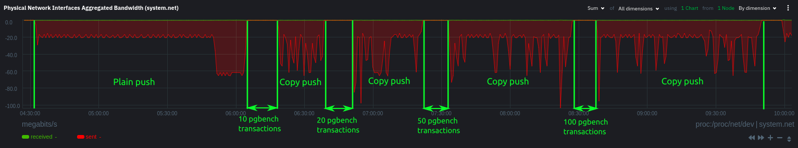
Tar size 1GB
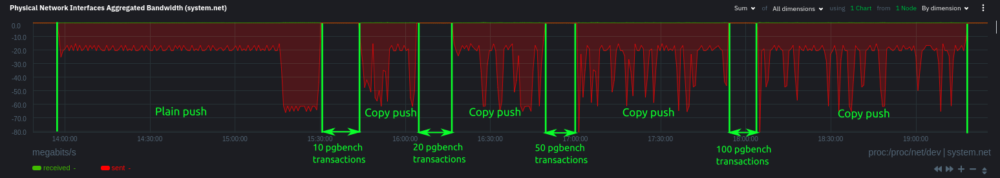
Tar size 5GB
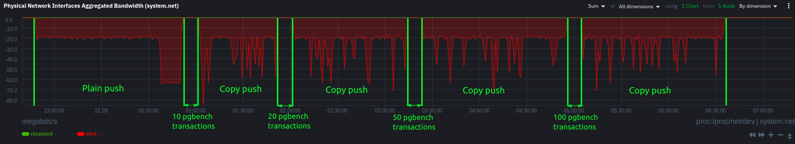