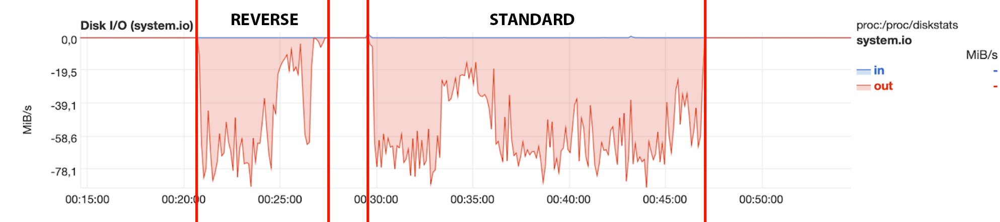
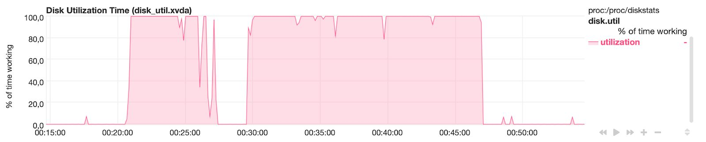
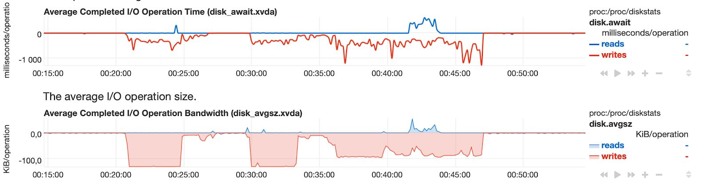
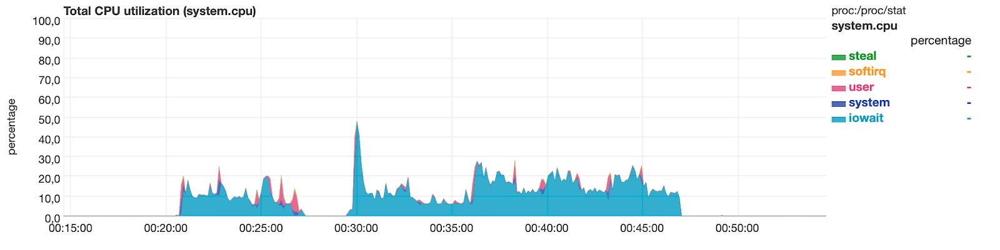
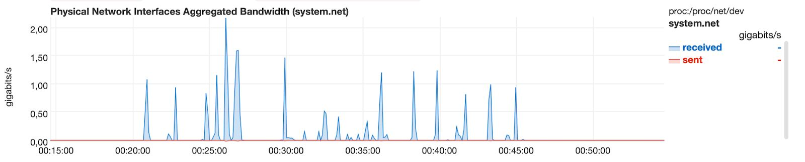
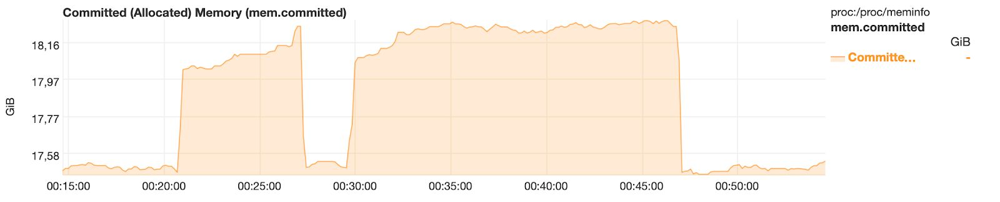
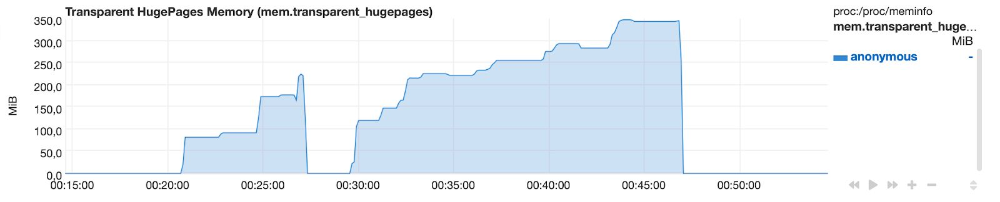
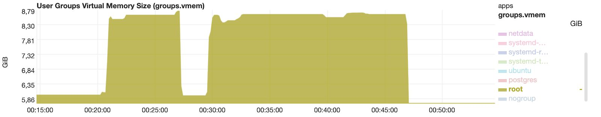
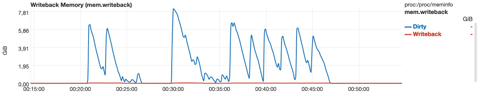

# Reverse delta unpack benchmark results

**Test VM specs**
- Amazon AWS EC2, instance type: m4.4xlarge
- CPU 8 core Intel Xeon E5-2676 v3 (-MT-MCP-) speed~2399 MHz (max) 
- Ubuntu 18.04
- Kernel~4.15.0-1057-aws x86_64 
- Mem~64402.4MB
- HDD~1099.5GB
- PostgreSQL 10.12

Backup storage: Amazon AWS S3 Bucket

Final database cluster size: 16 GB

## Test DB and backup creation log
Base backup:

`wal-g backup-push /var/lib/postgresql/10/main/`

Initial bench DB: (1600 MB)

`pgbench -i -s 1000 userdb`

1st delta:

`wal-g backup-push /var/lib/postgresql/10/main/`

Run bench transactions:

`pgbench -c 10 -j 2 -t 10000 userdb`

`pgbench --builtin tpcb-like --transactions 30000 --protocol=prepared --jobs=10 --client=10 userdb`

2nd delta:

`wal-g backup-push /var/lib/postgresql/10/main/`

Run more bench transactions :)

`pgbench --builtin tpcb-like --transactions 300000 --protocol=prepared --jobs=16 --client=16 userdb`

3rd delta:

`wal-g backup-push /var/lib/postgresql/10/main/`

Even more bench transactions

`pgbench --builtin tpcb-like --transactions 300000 --protocol=prepared --jobs=32 --client=16 userdb`

4th delta:

`wal-g backup-push /var/lib/postgresql/10/main/`

Some new bench transations

`pgbench --no-vacuum --builtin=simple-update --transactions 300000 --protocol=prepared --jobs=64 --client=16 userdb`

5th delta:

`wal-g backup-push /var/lib/postgresql/10/main/`

## Results: backup-fetch
### First attempt

**WAL-G with standard delta unpack**

- 17:10:36 Start
- 17:10:49 Base unpacked
- 17:14:17 1st delta unpacked
- 17:16:48 2nd delta unpacked
- 17:20:17 3rd delta unpacked
- 17:23:38 4th delta unpacked
- 17:26:51 5th delta unpacked. Done

Run time: approx 16 min 15 sec

**WAL-G with reverse delta unpack**

- 17:35:05 Start
- 17:39:13 5th delta unpacked
- 17:40:17 4th delta unpacked
- 17:40:58 3rd delta unpacked
- 17:41:05 2nd delta unpacked
- 17:41:18 1st delta unpacked
- 17:41:29 Base unpacked. Done

Run time: approx 6 min 24 sec

### Second attempt

**WAL-G with reverse delta unpack**

- 00:20:47 Start
- 00:24:44 5th delta unpacked
- 00:25:57 4th delta unpacked
- 00:26:35 3rd delta unpacked
- 00:26:43 2nd delta unpacked
- 00:26:57 1st delta unpacked
- 00:27:11 Base unpacked. Done

Run time: approx 6 min 24 sec

**WAL-G with standard delta unpack**

- 00:29:35 Start
- 00:29:49 Base unpacked
- 00:33:17 1st delta unpacked
- 00:36:04 2nd delta unpacked
- 00:39:42 3rd delta unpacked
- 00:43:11 4th delta unpacked
- 00:46:56 5th delta unpacked. Done

Run time: approx 17 min 21 sec

## Resource usage: second attempt

00:20 - 00:27 WAL-G with reverse delta unpack

00:29 - 00:46 WAL-G with standard delta unpack

**Disk usage**

**CPU usage**

**Network usage**

**Memory usage**

